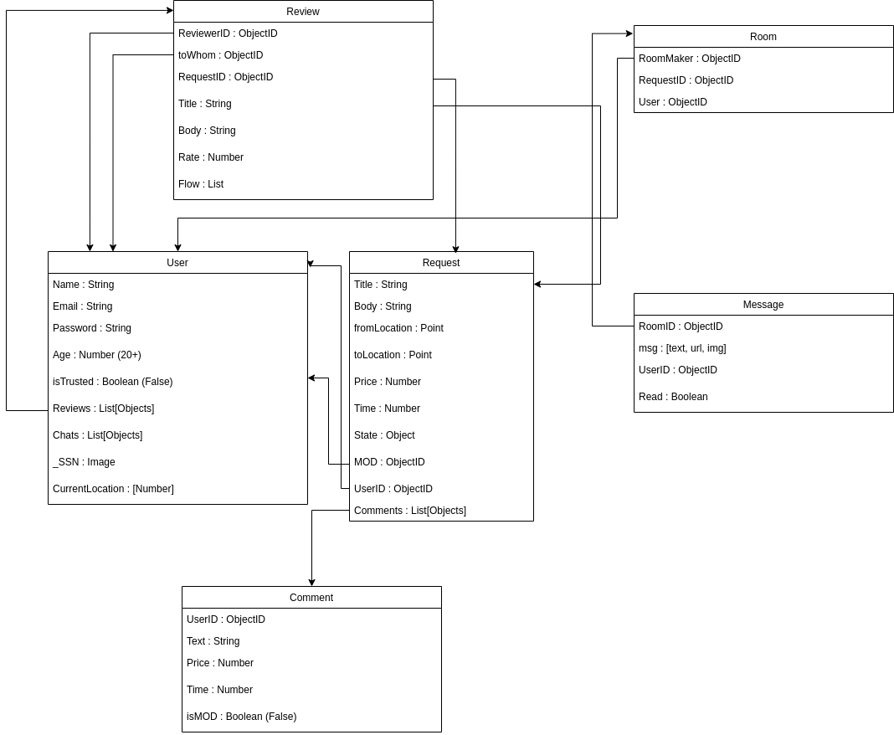

# Documentations

## Contents

- [Getting Started](#getting-started)
    - [Overview](#overview)
    - [Installation](#installation)
    - [Configurations](#configurations)
- [Endpoints](#endpoints)
    - [Routes](#routes) 
    - [HTTP requests](#http-requests)
    - [HTTP responses](#http-responses)
    - [HTTP Response Codes](#http-response-codes)
- [Socket Server](#socket-server)
    - [Authentication](#authentication)
    - [Events](#events)
- [Notification](#notification)
    - [Keys](#keys)
    - [Sending](#sending)


# Getting Started
## Overview
This Docs is for the [Gimme](../README.md) application, it's basically a REST API written in JS (NodeJS), aims to provide fast and clean architecture based on backend's best practices.

The following UML design is based on these [Stories](./stories/user.md)


## Installation
1. Install the dependencies: ```npm i```
2. Install [MongoDB](https://www.mongodb.com/try/download/community)
3. Run the tests: ```npm run test```
4. To try the api: 
    - Make sure to install [Postman](https://www.postman.com/downloads/)
    - Import the API [collection](./postman/Gimme.postman_collection.json)
5. Start the server by: ```npm run dev```

## Configurations
All the configurations can be found either in the ```.env``` or in the ```src/config``` which contains global configs for [Jest](https://jestjs.io/)

- For the environment vars:
    - Server runs on: ```PORT```
    - Production Database Name: ```DB_NAME```
    - Password related: ```MIN_PASS_LEN```, ```MAX_PASS_LEN```
    - [JWT](https://jwt.io/introduction) token related: ```SALT```, ```JWT_TOKEN```
    - All media related files for users are uploaded to: ```UPLOAD_LOC```
    - Max upload size: ```FILE_SIZE```
    - Max chat size that can be fetched by the API: ```CHAT_SIZE```
    - Routes ends with ```*_API```

### Notes
1. In real world, all the media contents (imgs, vids, ...) are stored separately in some remote servers like [amazon's S3](https://aws.amazon.com/s3/), but since we're doing local development, everything on the same server.
2. FCM token, which can be obtained from firebase-console, is stored under ```src/config``` 

# Endpoints
## Routes
The API has multiple endpoints aka routes, these routes are to be called to communicate with the backend, and to use all the routes you have to be authenticated.

- [Auth](./endpoints/auth.md)
- [User](./endpoints/user.md)
- [Request](./endpoints/request.md)
- [Comment](./endpoints/comment.md)
- [Review](./endpoints/review.md)
- [Location](./endpoints/location.md)
- [Notification](./endpoints/notification.md)

## HTTP requests
All API requests are made by sending a secure HTTPS request using one of the following methods, depending on the action being taken:

* `POST` Create a resource
* `PUT` Update a resource
* `GET` Get a resource or list of resources
* `DELETE` Delete a resource

For PUT and POST requests the body of your request may include a JSON payload, and the URI being requested may include a query string specifying additional filters or commands, all of which are outlined in the following sections.

## HTTP Responses
Each response will include a `status` which indicates if the process is successful or not, ```message``` for errors and others, and ```data```

## HTTP Response Codes
Each response will be returned with one of the following HTTP status codes:

* `200` `OK` The request was successful
* `400` `Bad Request` There was a problem with the request (security, malformed, data validation, etc.)
* `401` `Unauthorized` The supplied API credentials are invalid
* `403` `Forbidden` The credentials provided do not have permission to access the requested resource
* `404` `Not found` An attempt was made to access a resource that does not exist in the API
* `405` `Method not allowed` The resource being accessed doesn't support the method specified (GET, POST, etc.).
* `500` `Server Error` An error on the server occurred
# Socket Server
The socket server (for chat), runs on the same express server which holds the backend routes, probably it's a good idea to separate, just for the sake of simplicity.
```javascript
const app = require("./app.js")
// ...
const server = app.listen(PORT, () => {
    console.log(`Server is running on : http://localhost:${PORT}`)
})

global.io = require('socket.io')(server)
```
## Authentication
The authentication is done using socket.io [middlewares](https://socket.io/docs/v4/middlewares/#sending-credentials).

To authenticate users, JWT token should passed in the headers, since sockets uses HTTP.

Head to the middlewares for more info.
## [Events](https://socket.io/docs/v4/emitting-events/)
All [events](../src/utils/socket.js) are handled by the backend, but the frontend should emit to these specific routes:
- ```disconnect``` handles disconnection. 
- ```new-chat``` handles chat initation. 
- ```sub``` joins user to their chat-room. 
- ```leave``` leaves a user.
- ```new-msg``` sends a message and saves to db.
# Notification
Sending a notification is handled by google's [FCM](https://firebase.google.com/docs/cloud-messaging) (Firebase Cloud Messaging).

Since the notification is viewed at the frontend, you should use google's SDK for your [platform](https://firebase.google.com/docs/cloud-messaging/android/client).

## Keys
Before using FCM:
- Obtain the key from your google console.
- Add the key to ```src/config/fcm.json```
## Sending
To receive a notification from the backend, users should be subscribed to the notification service (after they are logged in) by sending their token to the backend ([here](./endpoints/notification.md))

User's token is saved with the user's payload under ```notification_token```